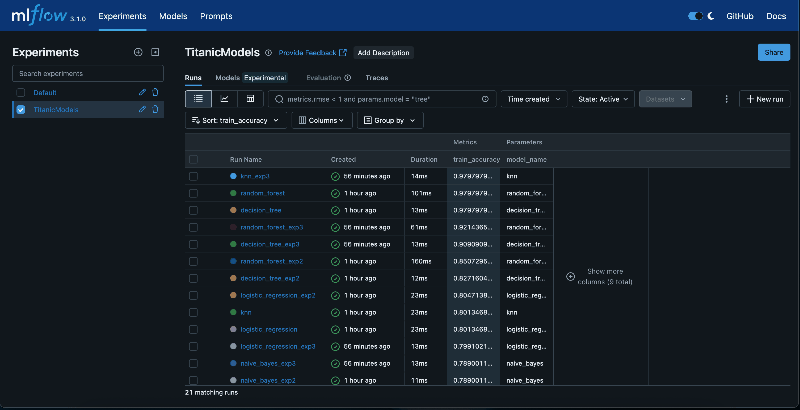

# MLOps Titanic Project

Этот проект направлен на демонстрацию навыков MLOps с использованием классического датасета Titanic.
Основной акцент сделан на настройку CI/CD пайплайнов, контейнеризацию, управление зависимостями и версионирование данных и моделей.

### Git Flow

- Работа ведется в отдельных ветках, созданных от main.
- Каждая новая фича оформляется в новой ветке (feature/название-фичи-через-тире).
- После завершения работы создается Pull Request в main
- Итогом: после прохождения всех CI-проверок и ревью Pull Request (даже если вы одни в команде) мержится в main.

> практика Pull Request сохраняется для прозрачности истории и проверки пайплайнов.

### CI/CD

##### Шаг 2: Публикация Docker-образа и Python-пакета

Job `publish-docker`:
- Авторизация в GitHub Container Registry (`ghcr.io`)
- Публикация образа: `docker push`
- Сборка Python-пакета: `pdm build`
- Загрузка артефакта: `.tar.gz` и `.whl` из `dist/`

> Прямая публикация Python-пакета в GitHub Packages невозможна без токена — вместо этого используется `upload-artifact`.

### Как собрать и запустить вручную

```bash
docker build -t mlops-titanic .
```

### Запуск

```bash
docker run --rm mlops-titanic
```

### Data Versioning with DVC + DAGsHub

В этом проекте используется [DVC](https://dvc.org/) для отслеживания данных и моделей. DVC позволяет:

- добавлять данные в репозиторий без хранения их в Git;
- отслеживать изменения в датасетах;
- переключаться между версиями;
- синхронизировать данные с удалённым хранилищем (в нашем случае — [DAGsHub](https://dagshub.com/katimanova/mlops_titanic)).

#### Используемые команды

```bash
# Инициализация DVC
dvc init

# Добавление сырых данных
dvc add data/raw/

# Добавление .dvc-файлов и игнорирования в Git
git add data/raw/*.dvc .gitignore

# Настройка удалённого хранилища (DAGsHub)
dvc remote add -d origin-dags https://dagshub.com/katimanova/mlops_titanic.dvc
dvc remote modify origin-dags --local auth basic
dvc remote modify origin-dags --local user katimanova
dvc remote modify origin-dags --local password <DAGsHub токен>

# Загрузка данных в удалённое хранилище
dvc push

# Восстановление данных из удалённого хранилища
dvc pull

# Переключение между версиями данных
git checkout <branch-or-commit>
dvc checkout
```

### MLflow 

Установка:
```bash
pdm add mlflow
```
Контроль через DVC после каждого эксперимента
```bash
pdm run dvc repro
dvc push
```

Запуск локального MLflow UI:
```bash
mlflow ui
```
> весь UI был локально по адресу http://127.0.0.1:5000

##### Отчет


| Эксперимент | Изменения параметров моделей                                          |
|-------------|----------------------------------------------------------------------------------|
| № 1     | Базовые значения моделей |
| № 2     | Усложнённые параметры (например, `n_neighbors=7`, `C=2.0`, `max_depth=5`)        |
| № 3     | Альтернативные параметры (`kernel="poly"`, `penalty="elasticnet"`)       |


###### Сравнение моделей по `train_accuracy` топ 10

| Модель                       | Точность (`train_accuracy`) |
|-----------------------------|------------------------------|
| `knn_exp3`                  | **0.9798**                   |
| `random_forest`             | **0.9798**                   |
| `decision_tree`             | **0.9798**                   |
| `random_forest_exp3`        | 0.9214                       |
| `decision_tree_exp3`        | 0.9091                       |
| `random_forest_exp2`        | 0.8507                       |
| `decision_tree_exp2`        | 0.8272                       |
| `logistic_regression_exp2`  | 0.8047                       |
| `knn`                       | 0.8013                       |
| `logistic_regression`       | 0.8013                       |

Как выглядит UI:

